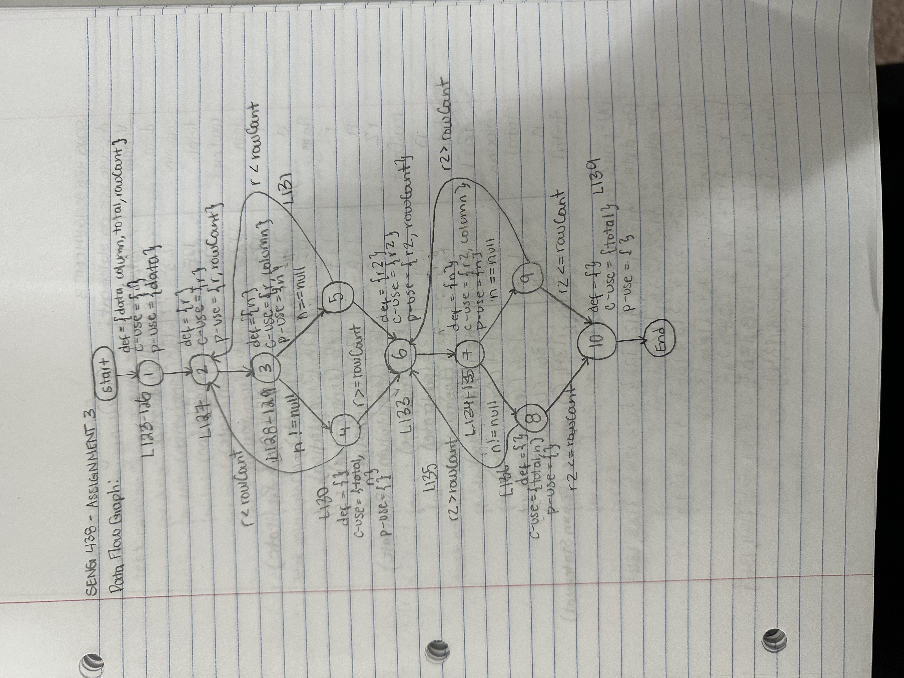
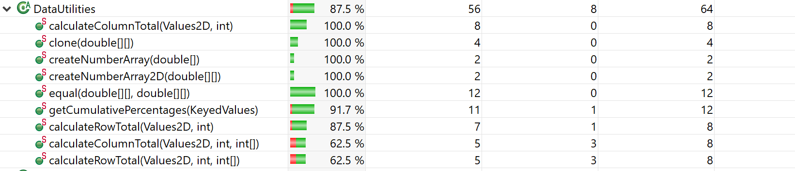
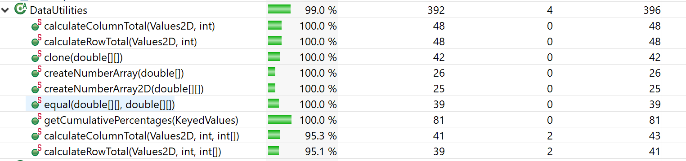
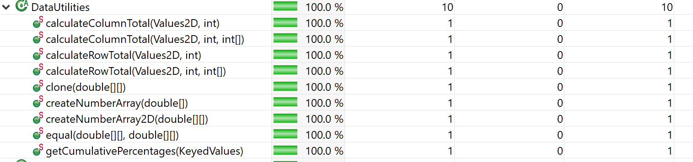

**SENG 438 - Software Testing, Reliability, and Quality**

**Lab. Report #3 – Code Coverage, Adequacy Criteria and Test Case Correlation**

| Group \#:        |          |
| ---------------- | -------- |
| Student Names:   |          |
| Maheen Raza      | 30137445 |
| Chloe Villaranda | 30097691 |
| Mehrnaz Zafari   | 30118953 |

(Note that some labs require individual reports while others require one report
for each group. Please see each lab document for details.)

# 1 Introduction

In this last assignment, our group looked at creating test suites for two classes: DataUtilities and Range, and these test suites were created using black box testing methods, as we had no access to the internal structure or source code of these classes.

For assignment 3, we were introduced to the importance of coverage when it comes to our test suites. Understanding, as well as measuring how well our test cases cover the code in the classes provided is an important feature to take into account when testing the behavior of a system, as it gauges an understanding of what our system is actually doing when we execute these tests.

Through this assignment, this idea of code coverage was approached by using different metrics of measuring coverage, whether it be statement, branch/decision, condition or method coverage.

# 2 Manual data-flow coverage calculations for X and Y methods

## For DataUtilities.calculateColumnTotal:

In order to calculate the DU-pair coverage for the method calculateColumnTotal() in class DataUtilities, I did the following:

### Draw Data Flow Graph:

### Def-Use Sets per Statement Chart:

| Variable | Def-line | Use-line          |
| -------- | -------- | ----------------- |
| data     | 123      | 124 (predicate)   |
| column   | 123      | 128 (computation) |
| total    | 125      | 130 (computation) |
| rowCount | 126      | 127 (predicate)   |
| data     | 123      | 126 (computation) |
| r        | 127      | 127 (predicate)   |
| r        | 127      | 127 (computation) |
| n        | 128      | 129 (predicate)   |
| data     | 123      | 128 (computation) |
| r        | 127      | 128 (computation) |
| n        | 128      | 130 (computation) |
| r2       | 133      | 133 (predicate)   |
| r2       | 133      | 133 (computation) |
| rowCount | 126      | 133 (predicate)   |
| n        | 134      | 135 (predicate)   |
| data     | 123      | 134 (computation) |
| r2       | 133      | 134 (computation) |
| column   | 123      | 134 (computation) |
| total    | 125      | 136 (computation) |
| n        | 134      | 136 (computation) |
| total    | 125      | 139 (occurence)   |

### List of all DU-pairs per variable:

#### For data:

{123, 124}, {123, 126}, {123, 128}, {123, 134}

#### For column:

{123, 128}, {123, 134}

#### For total:

{125, 130}, {125, 136}, {125, 139}

#### For rowCount:

{126, 127}, {126, 133}

#### For r:

{127, 127}, {127, 127}, {127, 128}

#### For n:

{128, 129}, {128, 130}, {134, 135}, {134, 136}

#### For r2:

{133, 133}, {133, 133}, {133, 134}

### DU-pair coverage for each test case:

#### For test calculateColumnTotalForOnlyTwoValidValues():

##### For data:

{123, 124}, {123, 126}, {123, 128}

##### For column:

{123, 128}

##### For total:

{125, 130}, {125, 139}

##### For rowCount:

{126, 127}

##### For r:

{127, 127}, {127, 127}, {127, 128}

##### For n:

{128, 129}, {128, 130}

##### For r2:

#### For test calculateColumnTotalForMoreThanTwoValidValues():

##### For data:

{123, 124}, {123, 126}, {123, 128}

##### For column:

{123, 128}

##### For total:

{125, 130}, {125, 139}

##### For rowCount:

{126, 127}

##### For r:

{127, 127}, {127, 127}, {127, 128}

##### For n:

{128, 129}, {128, 130}

##### For r2:

#### For test calculateColumnTotalForPositiveValuesOnly():

##### For data:

{123, 124}, {123, 126}, {123, 128}

##### For column:

{123, 128}

##### For total:

{125, 130}, {125, 139}

##### For rowCount:

{126, 127}

##### For r:

{127, 127}, {127, 127}, {127, 128}

##### For n:

{128, 129}, {128, 130}

##### For r2:

#### For test calculateColumnTotalForNegativeValuesOnly():

##### For data:

{123, 124}, {123, 126}, {123, 128}

##### For column:

{123, 128}

##### For total:

{125, 130}, {125, 139}

##### For rowCount:

{126, 127}

##### For r:

{127, 127}, {127, 127}, {127, 128}

##### For n:

{128, 129}, {128, 130}

##### For r2:

#### For test calculateColumnTotalWithPositiveAndNegativeValues():

##### For data:

{123, 124}, {123, 126}, {123, 128}

##### For column:

{123, 128}

##### For total:

{125, 130}, {125, 139}

##### For rowCount:

{126, 127}

##### For r:

{127, 127}, {127, 127}, {127, 128}

##### For n:

{128, 129}, {128, 130}

##### For r2:

#### For test calculateColumnTotalForSumOfZero():

##### For data:

{123, 124}, {123, 126}, {123, 128}

##### For column:

{123, 128}

##### For total:

{125, 130}, {125, 139}

##### For rowCount:

{126, 127}

##### For r:

{127, 127}, {127, 127}, {127, 128}

##### For n:

{128, 129}, {128, 130}

##### For r2:

#### For test calculateColumnTotalForEmptyDataTable():

##### For data:

{123, 124}, {123, 126}

##### For column:

##### For total:

{125, 139}

##### For rowCount:

{126, 127}, {126, 133}

##### For r:

##### For n:

##### For r2:

#### For test calculateColumnTotalForNullData():

##### For data:

{123, 124}, {123, 126}, {123, 128}

##### For column:

{123, 128}

##### For total:

##### For rowCount:

{126, 127}

##### For r:

{127, 127}, {127, 128}

##### For n:

{128, 129}

##### For r2:

#### For test calculateColumnTotalWithInvalidData():

##### For data:

{123, 124}, {123, 126}

##### For column:

{123, 128}

##### For total:

{125, 130}, {125, 139}

##### For rowCount:

{126, 127}

##### For r:

{127, 127}, {127, 128}

##### For n:

{128, 129}

##### For r2:

### Total DU-pair coverage:

Total DU-pair coverage for calculateColumnTotal = 88

# 3 A detailed description of the testing strategy for the new unit test

## For class DataUtilities:

Since I could not find any tool with condition coverage, I ended up using method coverage, provided by the ECLEmma tool.

In order to increase the statement, branch and method coverage for the class DataUtilities, I would look at the source code for each function and see what statements, branches or methods were not being hit by the test cases I already had in the test suite. For example, when I started with statement coverage, I saw that for both the calculateColumnTotal and calculateRowTotal functions, the second for loop was not being hit by the test cases I had. In order for the second for loop to be hit, r2 > rowCount and c2 > columnCount, where both c2 and r2 start off at the value of zero. Thus, I passed in negative values into the getColumnCount and getRowCount function for it to return a negative value for both rowCount and columnCount. I did something similar for branch coverage, where I looked for branches that were not tested in their entirety. For example, for the function getCumulativePercentage, I realized there was a branch that was not being hit where i < data.getItemCount(), where i is initially 0, so I passed in a negative value so that getItemCount() would return a negative value. There was also a branch "if (v != null)", so in order to hit this branch, I passed in a KeyedValues object that had null in it. I also added in additional test cases for the functions clone(double[][] source), equal(double[][] a, double[][] b), calculateColumnTotal(Values2D data, int column, int[] validRows) and calculateRowTotal(Values2D data, int row, int[] validCols) in order to increase the overall statement, branch and method coverage. For example for equal(), I tested different situations like when two double arrays are equal, aren't equal, have different lengths, or if one or both of them are null. I did the same for clone(), testing arrays that had valid values or null values. For the other two calculateColumnTotal and calculateRowTotal with 3 parameters, I passed in the additional argument of an int array with the valid rows.

# 4 A high level description of five selected test cases you have designed using coverage information, and how they have increased code coverage

## Test Cases created for DataUtilities:

1. test calculateColumnTotalForOnlyTwoValidValuesWithNegativeRowCount()
2. test calculateColumnTotalWithNullValueToHitIfStatementInSecondForLoop()
3. test calculateRowTotalForTwoValidValuesWithNegativeColumnCount()
4. test getCumulativePercentagesWithValidPositiveInputWithNegativeItemCount()
5. test getCumulativePercentagesWithNullValuesToHitIfStatement()
6. test equalForTwoPositiveArraysThatAreEqual()
7. test equalForTwoPositiveArraysThatAreNotEqual()
8. test equalForTwoArraysThatAreNull()
9. test equalForWhenArrayBIsNull()
10. test equalForWhenArrayAIsNull()
11. test equalForWhenArraysAreDifferentLengths()
12. test cloneForAPositiveArray()
13. test cloneForANullArray()
14. test calculateColumnTotalWithThreeParametersForOnlyTwoValidValues()
15. test calculateRowTotalWithThreeParametersForTwoValidValues()

In order to increase the statement, branch and method coverage for class DataUtilities, I added 15 new test cases in order to do so. I first focused on the main 5 functions I made test cases for in assignment 2, which were: calculateColumnTotal, calculateRowTotal, createNumberArray, createNumberArray2D and getCumulativePercentage. I had first made the assumption that we needed to take the coverage average of these 5 functions, to which I first added the test calculateColumnTotalForOnlyTwoValidValuesWithNegativeRowCount() and test calculateRowTotalForTwoValidValuesWithNegativeColumnCount(). At first, the average statement coverage of these 5 functions was 86.2%, and after adding these test cases, the statement coverage jumped to 97.04%. I then looked at branch coverage, which before adding the additional test cases for statement coverage, the average was at 76.66%, which then jumped to 86.66% after adding the test cases to target statement coverage. I then added the tests getCumulativePercentagesWithValidPositiveInputWithNegativeItemCount(), getCumulativePercentagesWithNullValuesToHitIfStatement(), and calculateColumnTotalWithNullValueToHitIfStatementInSecondForLoop() which caused the branch coverage to jump to 93.34%. Since I also decided to cover method coverage, I added test cases for all the different methods within the class, which include the clone(), equal(), calculateColumnTotal with three parameters and caculateRowTotal with three parameters. This caused the overall statement coverage to jump to 99.0% and branch coverage to jump to 87.5%.

# 5 A detailed report of the coverage achieved of each class and method (a screen shot from the code cover results in green and red color would suffice)

## Branch Coverage for DataUtilities:

## Statement Coverage for DataUtilites:

## Method Coverage for DataUtilities:

# 6 Pros and Cons of coverage tools used and Metrics you report

## For DataUtilities:

For the coverage tool, I decided to use ECLEmma, as it was already integrated with the IDE I use for Java, which was Eclipse. I enjoyed and found it easy to use this tool, as switching between statement, branch and method coverage was a lot easier and straightforward, as all I had to do was toggle a button to see the percentages for each coverage type. The downside was that none of the coverage tools had condition coverage, so I decided to switch to method coverage, which was provided by the ECLEmma tool. The metrics I used was also straightforward, and it was relatively easy to write test cases for, as statement coverage covered the different instructions in a function, branch coverage covered the different branches within a function, and method coverage let you know what methods you tested within the class. Overall, I found that working with both the tools and different metrics was wasy. Of course, just because we have hit a certain percent of coverage, doesn't mean our SUT is necessarily fault free.

# 7 A comparison on the advantages and disadvantages of requirements-based test generation and coverage-based test generation.

## For DataUtilities:
When looking at requirement-based testing, it tends to be easier to test, as you don't have to pressure yourself to hit a certain mark, and you can just test the obvious requirements of a certain function or a class from the perspective of a user who might use it. The disadvantage is that you might have missed certain bugs in the function that you didn't know were there, as that might have been the case when black box testing was implemented. 

When looking at coverage-based testing, one main advantage is that you are confident that you hit every aspect of your system in terms of looking for any faults or bugs, which may give developers a bit more confidence that their system doesn't have any issues. A disadvantage is that coverage-based testing tends to be tedious, as hitting certain percentages means increasing the amount of tests you write, which may be time consuming.

# 8 A discussion on how the team work/effort was divided and managed

In order to complete this lab, one member worked on DataUtilities, as it was the smaller class, while the rest of the 3 members worked on the Range class. Of course, members would look over each other's tests and check if there were any faults or anything missing with the test cases. 

# 9 Any difficulties encountered, challenges overcome, and lessons learned from performing the lab

Getting used to the coverage tools was a bit challenging, but this was overcome by asking TAs for help and assistance.

# 10 Comments/feedback on the lab itself

This lab was great for getting hands-on experience with coverage-based testing.
